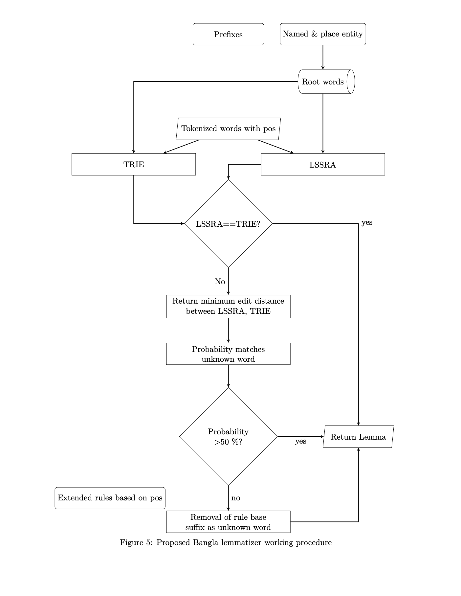

# KULemma

A Bangla lemmatizer developed by DGTED Lab, Khulna University.

## Paper Link

[KULemma_Towards_a_Comprehensive_Bangla_Lemmatizer](https://www.researchgate.net/publication/380828383_KULemma_Towards_a_Comprehensive_Bangla_Lemmatizer)

*Accuracy*: 96.90%.

### Development Steps:
- Collecting Lingual Resources.
- Compiling Lingual Resources into root words.
- Assembling stemming rules.
- Designing lemmatizer algorithms.
- Implementing lemmatizer algorithms.

### Installation Process
- clone git repository in your machine `git clone url`
- route into *kulemma* directory `cd kulemma`
- install packages `pip install -r requirements.txt`
- import PosLemmatizer form kulemma `from kulemma import PosLemmatizer`
- initialize lemmatizer `pos_lemmatizer = PosLemmatizer()`
- call lemmatize function `lemma = pos_lemmatizer.lemmatize(document)`

### Sample code
```
from kulemma import PosLemmatizer

document = """সরকারি চিকিৎসকদের অনীহার ফলে গ্রামের মানুষ অবিচারের শিকার হচ্ছে বলে মন্তব্য করেছেন পরিকল্পনামন্ত্রী।"""

pos_lemmatizer = PosLemmatizer()
lemma = pos_lemmatizer.lemmatize(document)
print(lemma)

# সরকারি চিকিৎসক অনীহা গ্রাম মানুষ অবিচার শিকার মন্তব্য পরিকল্পনা
```

Some Params of `PosLemmatizer()`
```
words_file= Array of root words in json format
lookup_file= Dictionary of unconventional words in json format
rules_file= Dictionary of rules in json format
stop_words= List of stop words in json format.
```

### System Overview



*Note*: You can customize root words, rules, pos tagger according to your use-case.
